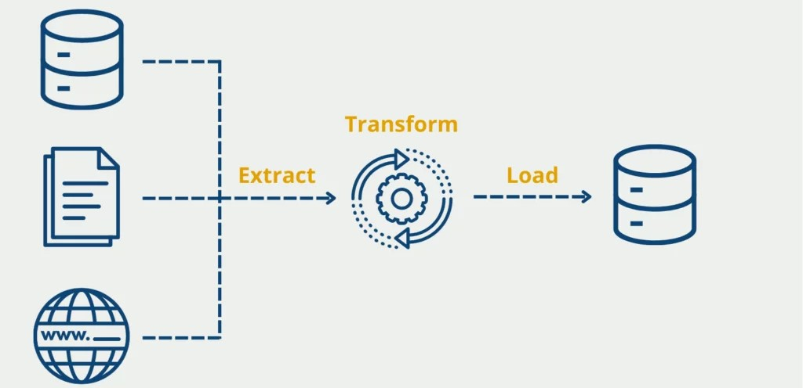
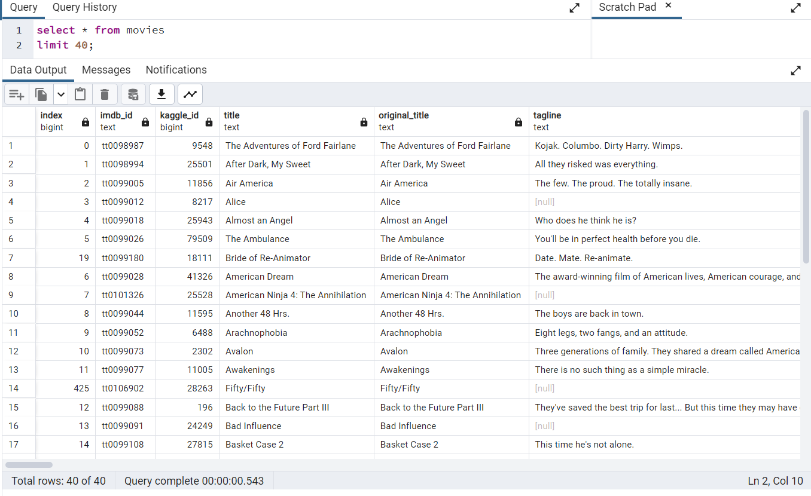

# Movies-ETL

## Project Overview
## *Overview*
In this project I will create a an automated pipeline that takes in scraped data from Wikipedia and IMDB, then transform and load it o an already existing PostgreSQL database.
  

  

## *Worflow*
<ol>
    <li>Read three data files (IMDB- Wikipedia- Ratings).</li>
    <li>Extract and Transform data.</li>
    <li>Load data to a PostgreSQL Movie Database.</li>
</ol>

## *Prerequisites*
Software: Python, Anaconda Navigator, Conda, Jupyter Notebook, PostgreSQL, pgAdmin 4.

 

## *Loading data in the PostgreSQL Movie Database*
  

  

## Summary
The ETL jupyter notebook created collects and cleans movie data from different sources (Wikipedia JSON and Kaggle and ratings csv files). It transforms and merges the data and loads it into two updatable PostgreSQL database table.
